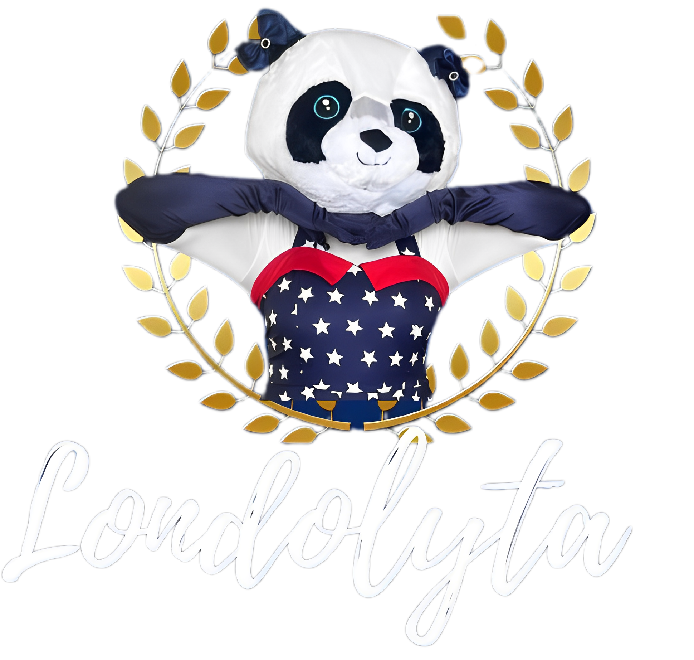

# LondolytaApp

{ height=0px }

O LondolytaApp é um projeto dedicado a um site que promove os serviços de uma mascote fictícia chamada Londolyta, especializada em entretenimento infantil através de animações em festas e venda de produtos relacionados. Este projeto visa fornecer uma plataforma online para divulgação dos serviços oferecidos, exibição de produtos disponíveis para compra e contato para contratação dos serviços.

 
<strong>Funcionalidades Principais</strong>    

- Página Inicial: Apresentação da Londolyta, breve descrição dos serviços oferecidos e produtos disponíveis.
- Galeria de Fotos e Vídeos: Mostra vídeos e fotos das animações em festas anteriores.
- Catálogo de Produtos: Exibe os produtos disponíveis para compra, como fantasias, brinquedos e acessórios temáticos.
- Formulário de Contato: Permite aos usuários entrar em contato para solicitar orçamentos e agendar serviços.
 

<strong>Como Usar:</strong>
 

Pré-requisitos: Verifique se você tem instalado um navegador web atualizado.
Clone ou Download: Faça o clone deste repositório ou baixe o código para sua máquina local.
Abra o Index.html: Abra o arquivo index.html em seu navegador para visualizar o site.
 

<strong>Tecnologias Utilizadas:</strong>  

- HTML5
- CSS3
- JavaScript
- Bootstrap 
 

<strong>Contribuindo:</strong>  

Se você deseja contribuir com melhorias ou correções, siga estas etapas:  

1- Faça um fork do repositório LondolytaApp.  
2- Crie sua branch de feature (git checkout -b feature/MinhaContribuicao).  
3- Commit suas alterações (git commit -am 'Adicionando nova funcionalidade').  
4- Push para a branch (git push origin feature/MinhaContribuicao).  
5- Abra um Pull Request.  
 

Autor  

- Lucas Lion 
